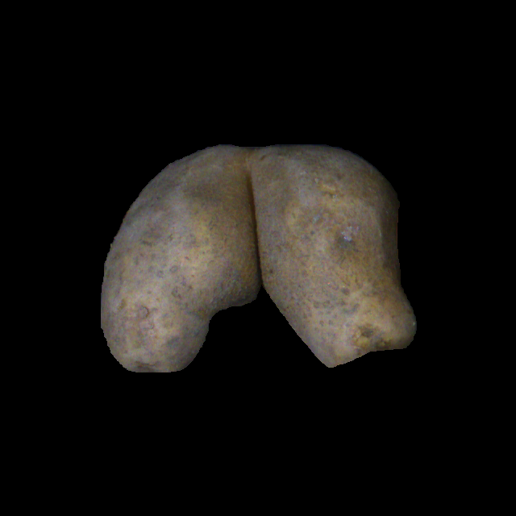

## Two Class classification Results
Classes: Good, Malformed

| Class | Color | Split Ratio | Val. Error Rate | Val. Accuracy | Start LR | Optimal LR             | Epochs |
|-------|-------|-------------|-----------------|---------------|----------|------------------------|--------|
| 2     | Yes   | 80:20       | 0.04            |               | 0.0002   | 0.00010964782268274575 | 18     |
| 2     | Yes   | 80:20       |                 | 97.95%        | 0.0001   | 5.248074739938602e-05  | 25     |
| 2     | Yes   | 70:30       | 0.02            |               | 0.0002   | 0.00019054606673307717 | 20     |
| 2     | Yes   | 70:30       |                 | 100%          | 0.0001   | 0.00013182566908653826 | 20     |
| 2     | No    | 80:20       | 0.00            |               | 0.0002   | 0.00019054606673307717 | 18     |
| 2     | No    | 80:20       |                 | 95.91%        | 0.0001   | 0.00013182566908653826 | 20     |
| 2     | No    | 70:30       | 0.02            |               | 0.0002   | 0.00010964782268274575 | 20     |
| 2     | No    | 70:30       |                 | 98.6%         | 0.0001   | 0.00015848931798245758 | 20     |

## Three Class classification Results
Classes: Good, Bottleneck, Ugly

| Class | Color | Split Ratio | Val. Error Rate | Val. Accuracy | Start LR | Optimal LR             | Epochs |
|-------|-------|-------------|-----------------|---------------|----------|------------------------|--------|
| 3     | Yes   | 80:20       | 0.02            |               | 0.0002   | 0.0002754228771664202  | 18     |
| 3     | Yes   | 80:20       |                 | 97.95%        | 0.0001   | 6.30957365501672e-05   | 25     |
| 3     | Yes   | 70:30       | 0.04            |               | 0.0001   | 7.585775892948732e-05  | 20     |
| 3     | Yes   | 70:30       |                 | 95.94%        | 0.0001   | 7.585775892948732e-05  | 20     |
| 3     | No    | 80:20       | 0.04            |               | 0.0002   | 0.0002290867705596611  | 18     |
| 3     | No    | 80:20       |                 | 95.91%        | 0.0001   | 0.00015848931798245758 | 20     |
| 3     | No    | 70:30       | 0.02            |               | 0.0002   | 0.00019054606673307717 | 20     |
| 3     | No    |             |                 | 97.29%        | 0.0001   | 0.00013182566908653826 | 25     |

## Fourier Transoformation Interpretation Results
1. ER = Energy Ratio
2. PF = Peak Frequency
3. SE = Spectral Entropy

* Generally High Energy Ratio like > 0.80 suggests a smooth, elliptical shape
* Low Peak Frequencey of < 5 suggests high low frequency components, meaning irregular shapes
* Lower Spectral Entropy (SE) means smoother, more regular eliptical shape while higher spectral entropy corresponds to complex, irregular shapes.

| Class      | No of Imgs | Max ER | Min ER | Avg ER | Median ER | Max PF | Min PF | Avg PF | Median PF | Max SE | Min SE | Avg SE | Median SE |
|------------|------------|--------|--------|--------|-----------|--------|--------|--------|-----------|--------|--------|--------|-----------|
| Good       | 119        | 0.90   | 0.79   | 0.86   | 0.87      | 0      | 0      | 0      | 0         | 2.53   | 1.36   | 1.79   | 1.76      |
| Bottleneck | 59         | 0.81   | 0.74   | 0.78   | 0.77      | 0      | 0      | 0      | 0         | 2.88   | 2.22   | 2.49   | 2.49      |
| Ugly       | 67         | 0.85   | 0.75   | 0.81   | 0.82      | 0      | 0      | 0      | 0         | 2.94   | 1.85   | 2.28   | 2.23      |

#### Table Transposed
| Class      | Good | Bottleneck | Ugly |
|------------|------|------------|------|
| No of Imgs | 119  | 59         | 67   |
| Max ER     | 0.90 | 0.81       | 0.85 |
| Min ER     | 0.79 | 0.74       | 0.75 |
| Avg ER     | 0.86 | 0.78       | 0.81 |
| Median ER  | 0.87 | 0.77       | 0.82 |
| Max PF     | 0    | 0          | 0    |
| Min PF     | 0    | 0          | 0    |
| Avg PF     | 0    | 0          | 0    |
| Median PF  | 0    | 0          | 0    |
| Max SE     | 2.53 | 2.88       | 2.94 |
| Min SE     | 1.36 | 2.22       | 1.85 |
| Avg SE     | 1.79 | 2.49       | 2.28 |
| Median SE  | 1.76 | 2.49       | 2.23 |

# For Fourier Based Prediction
Uset the `malform_prediction_final.py` file for prediction. Example use cases inside the file
Basically this file will return which cluster a single image belongs to with the `prediction_cluster_value(self, image_path, order=30)` method. It also gives you the ability to plot the potato and the shape that was detected using the `plot_predicted_clusters(self, predicted_cluster, avg_shape, image_to_predict_path)` method.

# Fourier with Shape Value Results

| Type/Data    	| Min   	| Max   	| Avg   	| Std  	| Mode  	|
|--------------	|-------	|-------	|-------	|------	|-------	|
| Very Gingery 	| 34.75 	| 57.94 	| 43.93 	| 7.79 	| 38.8  	|
| Heart        	| 27.22 	| 56.44 	| 46.69 	| 8.1  	| 49.89 	|
| Good         	| 9.73  	| 27.17 	| 17.33 	| 3.74 	| 18.98 	|
| Gingery      	| 24.08 	| 49.19 	| 35.17 	| 7.25 	| 32.14 	|
| Bottleneck   	| 21.11 	| 52.08 	| 36.33 	| 6.71 	| 28.89 	|
| Bobble       	| 22.97 	| 50.10 	| 36.10 	| 6.7  	| 28.89 	|

## Reasoning
* The results that Tao got was based on number of edges. The more unusal edges, the higher the score.
* The formula seems to work as we get small values for good shaped potatoes.

## Visual Distributions

### Heart Shape Potatoes

### Good Shape Potatoes

### Gingery Shape

### Very Gingery Shapes

### Bottleneck Shapes

### Bobble Shapes

